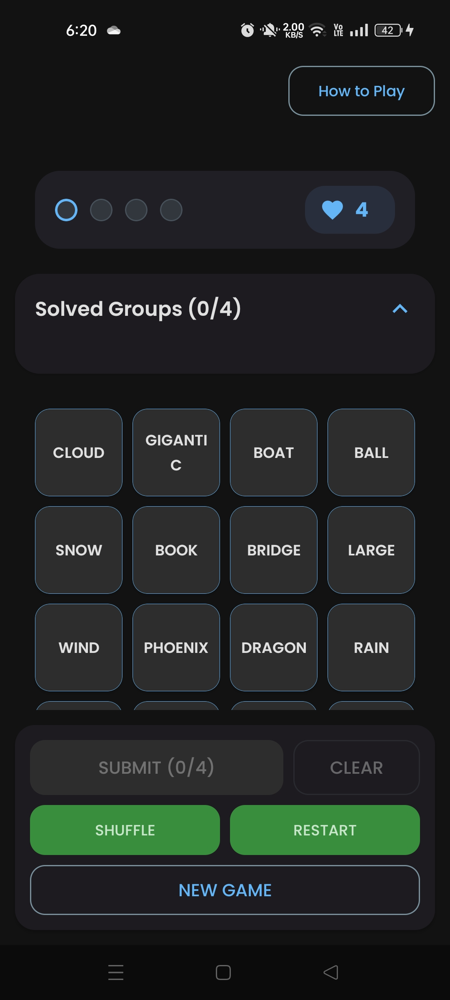
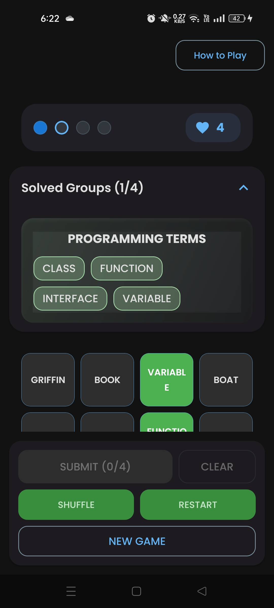

# Word Connections Android App

[](https://kotlinlang.org/)
[](https://developer.android.com/)
[](https://developer.android.com/jetpack/compose)

A modern Android puzzle game inspired by NYT Connections. Built with Jetpack Compose, Material 3, and clean architecture principles.

## Demo

| Main Game | Word Selection | Victory Screen |
|-----------|----------------|----------------|
|  |  |  |

| Instructions |
|--------------|
|  |  |

## Features

- **Word Puzzle Gameplay** - Group words into categories with real-time validation
- **Offline Support** - Play with cached puzzles when offline
- **Responsive Design** - Optimized for phones and tablets
- **Material 3 UI** - Modern, accessible design system
- **Progress Tracking** - Daily puzzle completion with automatic reset

## Tech Stack

- **Kotlin** - Primary language
- **Jetpack Compose** - UI toolkit
- **Material 3** - Design system
- **MVVM Architecture** - Clean separation of concerns
- **Room Database** - Local data persistence
- **Retrofit** - API communication
- **Hilt** - Dependency injection
- **WorkManager** - Background tasks

## Getting Started

### Prerequisites
- Android Studio (latest version)
- Android SDK API 24+
- Kotlin 1.9+

### Installation
1. Clone the repository
2. Open `frontend` folder in Android Studio
3. Sync project and run on device/emulator

## Project Structure

```
app/src/main/java/com/aiswarya/wordconnections/
├── data/           # Data layer (local DB, network, repository)
├── domain/         # Business logic (models, use cases)
├── presentation/   # UI layer (screens, viewmodels, components)
├── di/            # Dependency injection
└── work/          # Background work
```

## Backend Integration

The app connects to the Word Connections Backend API for:
- Puzzle generation and validation
- Offline fallback with cached data
- Real-time game state management

